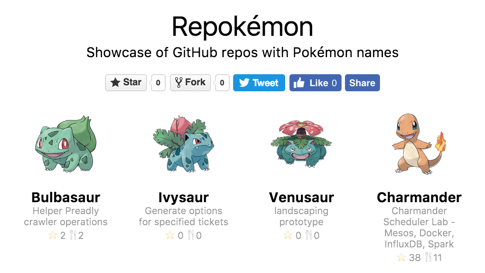

Repokémon
===

Showcase of GitHub repos with Pokémon names.

How?
---

1. Scrape a list of all pokémons.
2. Use GitHub API and search for every pokémon name.
3. Get a matching repository name with highest number of stars.
4. 💥💥💥

Dev
---

- `npm run pokemon` - grab the pokémons
- `npm run repokemon` - grab the Github repos
  - Copy `config.sample.json` to `config.json`, configure it with `client_id` and `client_secret` from GitHub
  - Takes about 30 minutes to prevent API rate limit issues

Credits
---

Pokémon data and images are extracted from the [official Pokédex web site](http://www.pokemon.com/us/pokedex/). All Pokémon content is © Nintendo, Game Freak, and The Pokémon Company.

Repokémon is not affiliated with GitHub, Nintendo, Game Freak, or The Pokémon Company in any way.

The logo is created by [@limhenry](https://github.com/limhenry). Available on [Codepen](http://codepen.io/limhenry/full/rLYkWY/).